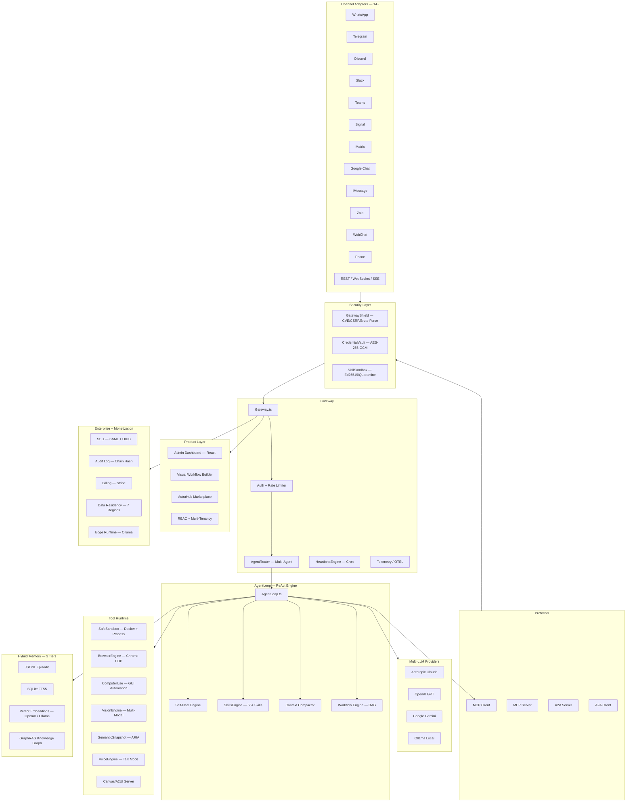

<](https://github.com/AstraOS-India/astra-os)
[](LICENSE)
[](https://github.com/AstraOS-India/astra-os/actions)
[](https://www.typescriptlang.org/)
[](https://nodejs.org/)
[](Dockerfile)
[](https://modelcontextprotocol.io)
[](https://google.github.io/A2A)
[](#)

**Built in India. Designed for the world. Security-first. Multi-LLM. Multi-Agent. Enterprise-Ready.**

</div>

---

AstraOS (Sanskrit: *Astra* = divine weapon / celestial tool) is the most secure open-source AI agent operating system. It combines **GatewayShield** security (CVE prevention, CSRF, brute force protection), **CredentialVault** (AES-256-GCM encrypted secrets), **SkillSandbox** (Ed25519 signing, static analysis, quarantine), MCP + A2A protocols, GraphRAG memory, Computer Use, Talk Mode voice, 14+ messaging channels, 55+ bundled skills, RBAC + multi-tenancy, admin dashboard, visual workflow builder, AstraHub marketplace, enterprise SSO (SAML + OIDC), immutable audit log, Stripe billing, data residency, and edge runtime with offline-first Ollama.

**Market:** AI Agent platforms are a $7.63B market (2025) growing to $183B by 2033 at 49.6% CAGR. AstraOS is the only open-source platform with ALL critical capabilities in one OS.

---

## Why AstraOS vs OpenClaw

| Capability | OpenClaw | **AstraOS v4.0** |
|-----------|----------|-------------------|
| **Security Layer** | CVE-2026-25253 (token leak), plaintext credentials, ClawHavoc skill attacks | **GatewayShield** (CVE prevention, CSRF, brute force) + **CredentialVault** (AES-256-GCM) + **SkillSandbox** (Ed25519 signing, quarantine) |
| **Channels** | ~10 | **14+** (WhatsApp, Telegram, Discord, Slack, Teams, Signal, Matrix, Google Chat, iMessage, Zalo, WebChat, Phone, REST, WebSocket) |
| **Skills** | ClaHub (no security scan) | **55+ bundled**, AstraHub CLI, SkillGenerator (23 templates), ClawHub migration with security scan |
| **Talk Mode** | Basic voice | **Full Talk Mode** — interrupt, wake word, push-to-talk, ElevenLabs TTS, Whisper/Deepgram STT, VAD |
| **Enterprise SSO** | No | **SAML 2.0 + OpenID Connect** (PKCE, Azure AD, Okta, Google Workspace) |
| **RBAC** | No | **4 roles** (Admin, Developer, Operator, Viewer) + multi-tenancy + JWT |
| **Audit Log** | No | **Immutable SHA-256 chain hash** + GDPR export/erasure + SOC2/HIPAA |
| **Billing** | No | **Stripe** — subscriptions, usage metering, invoices, checkout, webhooks |
| **Data Residency** | No | **7 regions** + AES-256-GCM encryption + PII masking + export compliance |
| **Edge Runtime** | No | **Ollama offline-first** — standalone, sync, gateway modes |
| **MCP Protocol** | No | **Full** (Client + Server) |
| **A2A Protocol** | No | **Full** (Agent cards + task lifecycle) |
| **GraphRAG Memory** | No | **FTS5 + Vector + Knowledge Graph** with RRF |
| **Computer Use** | No | **Screenshot + click + type + scroll** GUI automation |
| **Observability** | No | **OpenTelemetry** — traces, metrics, spans, histograms |
| **Admin Dashboard** | No | **React + Vite** — 11 pages, dark theme, real-time data |
| **Visual Workflow Builder** | No | **React Flow** DAG editor with 7 node types |
| **Managed Hosting** | MyClaw.ai ($19/mo) | **AstraCloud** ($15/mo) — cheaper, more features |
| **Setup Experience** | `openclaw onboard` | **`npx astra-os`** + `setup.sh` + `setup.ps1` + one-click deploy |

---

## Features

### Core

- **Multi-LLM** — Claude, GPT-4o, Gemini, Ollama. Auto-detect model from name, hot-swap per request, streaming
- **MCP Protocol** — Full MCP client + server. Connect external MCP tools and expose all AstraOS tools to the ecosystem
- **A2A Protocol** — Google's Agent-to-Agent protocol. Agent card at `/.well-known/agent.json`, task lifecycle, SSE streaming
- **GraphRAG Memory** — Three-tier hybrid with Reciprocal Rank Fusion: FTS5 full-text, vector embeddings (OpenAI / Ollama), entity-relationship knowledge graph with community detection
- **Self-Healing ReAct Loop** — On failure: read logs, diagnose with LLM, propose patch, retry automatically
- **DAG Workflow Engine** — Directed acyclic graph workflows with checkpointing: `llm_call`, `tool_call`, `condition`, `parallel`, `loop`, `human_input`, `transform`
- **Multi-Modal Vision** — Analyze images, screenshots, documents, and charts via vision-capable LLMs (Claude, GPT-4o, Gemini)

### Channels (14+)

| Channel | Transport | Adapter |
|---------|-----------|---------|
| WhatsApp | Cloud API | `WhatsAppAdapter` |
| Telegram | Bot API | `TelegramAdapter` |
| Discord | Gateway | `DiscordAdapter` |
| Slack | Events API | `SlackAdapter` |
| Microsoft Teams | Bot Framework | `TeamsAdapter` |
| Signal | Signal CLI | `SignalAdapter` |
| Matrix | Matrix SDK | `MatrixAdapter` |
| Google Chat | Chat API | `GoogleChatAdapter` |
| iMessage | BlueBubbles | `iMessageAdapter` |
| Zalo | Zalo API | `ZaloAdapter` |
| WebChat | Embedded widget | `WebChatAdapter` |
| Phone | Twilio / SIP | `PhoneAdapter` |
| REST API | HTTP | Built-in |
| WebSocket | WS | Built-in |

### Security

AstraOS v4.0 ships three dedicated security subsystems that directly address known vulnerabilities in competing platforms:

**GatewayShield** — Comprehensive gateway security layer
- CVE prevention: never accepts auth tokens from URL query params (prevents CVE-2026-25253 class attacks)
- CSRF protection with double-submit cookie pattern (SameSite=Strict)
- Brute force protection with configurable lockout (10 attempts / 30-min lockout)
- Public exposure detection with alerting
- Security headers (HSTS, X-Frame-Options, CSP, X-Content-Type-Options)
- IP allowlist/denylist for network access control
- Request origin validation
- Security scoring and grading (A+ to F)

**CredentialVault** — Encrypted credential storage
- AES-256-GCM encryption for all API keys, tokens, and secrets at rest
- Per-credential IV and salt with GCM authentication tags
- Key rotation support with zero-downtime re-encryption
- Access audit trail for every credential read/write
- Auto-expiry for time-limited credentials
- Import/export with encrypted transport

**SkillSandbox** — Deep skill security analysis and signing
- Ed25519 cryptographic signing for verified publishers
- Deep static analysis beyond simple regex (AST-level pattern detection)
- Permission manifest enforcement — skills declare required permissions upfront
- Reputation scoring system tracking skill safety history
- Quarantine system — auto-quarantine flagged skills with review workflow
- Community reporting for crowdsourced security intelligence

### Skills (55+ Bundled)

AstraOS ships with 55 production-ready skills across 10 categories:

| Category | Skills |
|----------|--------|
| Productivity | weather-alerts, email-assistant, calendar-manager, task-manager, note-taker, meeting-summarizer, pomodoro-timer, daily-standup, inbox-zero |
| Developer | code-reviewer, git-assistant, ci-monitor, docker-manager, api-tester, regex-helper, sql-assistant, dependency-checker |
| Data | csv-analyzer, json-transformer, web-scraper, data-visualizer, log-analyzer |
| Finance | expense-tracker, stock-watcher, invoice-generator, currency-converter, cloud-cost |
| IoT | smart-home, iot-monitor, energy-tracker |
| Security | password-generator, security-scanner, ip-reputation |
| Content | blog-writer, report-generator, social-poster |
| Communication | youtube-summarizer, slack-manager, rss-reader, discord-bot, whatsapp-business, sms-sender, notification-hub |
| AI / NLP | image-analyzer, document-qa, translator, text-summarizer, sentiment-analyzer |
| DevOps | server-monitor, ssl-checker, dns-lookup, port-scanner, cron-scheduler, file-converter, system-info |

**AstraHub CLI** — Install, publish, search, and manage skills from the command line:

```bash
# Search marketplace
npx astra-hub search "weather"

# Install a skill
npx astra-hub install weather-alerts

# Publish your skill
npx astra-hub publish ./skills/my-skill
```

**SkillGenerator** — Scaffold production-ready skills from 23 templates:

```bash
# List templates
curl http://localhost:3000/api/skills/templates

# Generate from template
curl -X POST http://localhost:3000/api/skills/generate \
  -H "Content-Type: application/json" \
  -d '{"template":"api-connector","name":"my-api-skill","author":"YourName"}'
```

Templates: `api-connector`, `webhook-handler`, `database-query`, `email-manager`, `calendar-assistant`, `task-tracker`, `note-taker`, `code-reviewer`, `ci-cd-monitor`, `log-analyzer`, `git-assistant`, `data-analyzer`, `web-scraper`, `report-generator`, `slack-bot`, `notification-hub`, `image-describer`, `translation`, `summarizer`, `smart-home`, `sensor-monitor`, `expense-tracker`, `stock-watcher`

**ClawHub Migration** — Import skills from OpenClaw/ClawHub with automatic conversion and security scanning:

```bash
# Migrate a ClawHub skill
curl -X POST http://localhost:3000/api/skills/migrate \
  -H "Content-Type: application/json" \
  -d '{"source":"clawhub","skillId":"weather-pro"}'

# Bulk import with validation
curl -X POST http://localhost:3000/api/skills/migrate/bulk \
  -H "Content-Type: application/json" \
  -d '{"source":"clawhub","skills":["skill-1","skill-2","skill-3"]}'
```

### Enterprise

- **SSO** — SAML 2.0 + OpenID Connect (PKCE with S256). Azure AD, Okta, Google Workspace, Auth0, OneLogin
- **RBAC** — 4 roles (Admin, Developer, Operator, Viewer), JWT authentication, API key management, tenant isolation with plan-based quotas
- **Audit Log** — SHA-256 chain-hashed immutable trail. SOC2, GDPR, HIPAA compliance. Tamper detection, GDPR data export and right to erasure
- **Billing** — Stripe subscriptions, usage metering, invoices, Checkout sessions, Customer Portal, webhook handling (HMAC-SHA256)
- **Data Residency** — 7 regions (India South, India Central, EU, US East, US West, Singapore, Local/On-Premise). AES-256-GCM encryption at rest, PII masking (email, phone, Aadhaar, PAN), export compliance
- **Edge Runtime** — Offline-first with Ollama local models. Standalone, sync, and gateway modes. Offline queue with automatic sync on reconnect

### Voice (Talk Mode)

Full-duplex conversational voice powered by Talk Mode:

- **Interrupt support** — interrupt the agent mid-sentence, it stops speaking and listens
- **Wake word detection** — configurable wake word activation
- **Push-to-talk** — manual activation mode for noisy environments
- **ElevenLabs TTS** — high-quality text-to-speech with configurable voice, stability, and similarity
- **Whisper / Deepgram STT** — speech-to-text with confidence scoring and language detection
- **VAD (Voice Activity Detection)** — configurable sensitivity and silence timeout
- **State machine** — `listening` -> `processing` -> `speaking` -> `interrupted`

```bash
# Text-to-speech
curl -X POST http://localhost:3000/api/voice/tts \
  -H "Content-Type: application/json" \
  -d '{"text":"Hello from AstraOS","voiceId":"EXAVITQu4vr4xnSDxMaL"}'

# Speech-to-text
curl -X POST http://localhost:3000/api/voice/stt \
  -F "audio=@recording.wav"
```

### Tools

- **Browser Automation (CDP)** — Full Chrome DevTools Protocol: navigate, click, type, screenshot, evaluate, extract. Puppeteer + ARIA tree parsing via SemanticSnapshot
- **Computer Use** — Screenshot-based GUI automation: `screenshot`, `click`, `double_click`, `type`, `key`, `scroll`, `cursor_position`, `drag`
- **Docker Sandbox** — Ephemeral containers per session with memory/CPU limits, read-only FS, network isolation. Hybrid Docker + process fallback
- **Canvas / A2UI** — Agents generate interactive HTML UIs with `astra-*` attributes. User interactions trigger agent callbacks via WebSocket push

### Observability

- **OpenTelemetry** — Built-in tracing, metrics, spans, counters, and histograms for every agent run, tool call, and LLM request
- **Admin Dashboard** — React + Vite + Tailwind dark-mode dashboard with 8 pages: Home (stats), Agents, Conversations, Marketplace, Workflow Builder (React Flow), Memory (graph visualization), Traces, Settings

---

## Quick Start

### Option A: Interactive Wizard (Recommended)

```bash
git clone https://github.com/AstraOS-India/astra-os
cd astra-os
npx astra-os
```

The wizard guides you through LLM provider selection, API key setup, security key generation, dependency installation, build, and health check — all in one interactive flow.

### Option B: Platform Scripts

```bash
# macOS / Linux
git clone https://github.com/AstraOS-India/astra-os
cd astra-os && bash setup.sh

# Windows (PowerShell)
git clone https://github.com/AstraOS-India/astra-os
cd astra-os; .\setup.ps1
```

### Option C: Manual Setup

```bash
git clone https://github.com/AstraOS-India/astra-os
cd astra-os
cp .env.example .env        # Edit .env — add your API key
npm install && npm run build
npm start
```

### Verify

```bash
# Health check
curl http://localhost:3000/health

# Send a message
curl -X POST http://localhost:3000/api/chat \
  -H "Content-Type: application/json" \
  -d '{"message":"Check weather in Chennai","userId":"demo"}'

# Stream a response
curl -N -X POST http://localhost:3000/api/chat/stream \
  -H "Content-Type: application/json" \
  -d '{"message":"Write a haiku","userId":"demo"}'
```

Open **http://localhost:3000** for the Dashboard, **http://localhost:3000/docs** for API docs.

### Docker

```bash
docker compose up -d
# AstraOS runs on :3000
```

---

## AstraCloud — Managed Hosting

Don't want to self-host? **AstraCloud** is our fully managed hosting platform — like MyClaw.ai, but cheaper and more powerful.

| Plan | Price | Specs | Features |
|------|-------|-------|----------|
| **Starter** | $15/mo | 2 vCPU, 4GB RAM, 40GB SSD | 55+ skills, 14+ channels, daily backups |
| **Pro** | $35/mo | 4 vCPU, 8GB RAM, 80GB SSD | + GraphRAG, workflows, MCP/A2A, priority support |
| **Enterprise** | $69/mo | 8 vCPU, 16GB RAM, 160GB SSD | + SSO, audit log, data residency, RBAC |

Visit `/cloud` on your AstraOS instance or deploy to try it.

---

## One-Click Cloud Deploy (Self-Host)

[](https://railway.app/template/astra-os)
[](https://render.com/deploy?repo=https://github.com/AstraOS-India/astra-os)
[](https://cloud.digitalocean.com/apps/new?repo=https://github.com/AstraOS-India/astra-os)

### Railway

```bash
# Or via Railway CLI
railway init && railway up
```

Uses `railway.toml` — auto-builds backend + dashboard, serves on port 3000 with health checks.

### Render

Uses `render.yaml` blueprint — auto-generates JWT_SECRET and MASTER_ENCRYPTION_KEY. Just add your `ANTHROPIC_API_KEY`.

### Fly.io

```bash
fly launch --name my-astra-os
fly secrets set ANTHROPIC_API_KEY=sk-ant-...
fly deploy
```

---

## Config-First Setup

AstraOS uses a config-first approach with two key files:

### SOUL.md

Defines your agent's personality, behavior rules, response style, and guardrails. Loaded at startup and injected as system context for every conversation.

```markdown
---
name: Aria
persona: Friendly AI assistant for customer support
tone: Professional, warm, concise
language: English
guardrails:
  - Never share internal system details
  - Always verify user identity before account changes
  - Escalate billing issues to human agents
---

You are Aria, a customer support agent for Acme Corp...
```

### AGENTS.md

Configures multi-agent routing, channel assignments, skill bindings, and model preferences per agent.

```markdown
---
agents:
  - name: support-agent
    model: claude-sonnet-4-20250514
    channels: [whatsapp, webchat]
    skills: [email-assistant, task-manager]
  - name: dev-agent
    model: gpt-4o
    channels: [slack, discord]
    skills: [code-reviewer, git-assistant, ci-monitor]
---
```

---

## Architecture



---

## Skills

### Creating Skills

Create a folder in `skills/` with a `SKILL.md` file:

```markdown
---
name: my-skill
version: 1.0.0
description: What this skill does
author: Your Name
triggers:
  - keyword1
  - keyword2
permissions:
  - network:outbound
  - filesystem:read
---

Instructions for the agent when this skill activates...
```

Skills are auto-loaded on startup and selectively injected when trigger keywords match the user's message.

### Installing from AstraHub

```bash
# Search the marketplace
curl http://localhost:3000/api/marketplace/search?q=weather

# Install a skill
curl -X POST http://localhost:3000/api/marketplace/skills/weather-alerts/install

# All installed skills are security-scanned by SkillSandbox before activation
```

### Migrating from ClawHub

```bash
# Single skill migration
curl -X POST http://localhost:3000/api/skills/migrate \
  -H "Content-Type: application/json" \
  -d '{"source":"clawhub","skillId":"my-openclaw-skill"}'

# Bulk import
curl -X POST http://localhost:3000/api/skills/migrate/bulk \
  -H "Content-Type: application/json" \
  -d '{"source":"clawhub","skills":["skill-a","skill-b"]}'
```

The migrator auto-converts OpenClaw SKILL.md format (triggers, tools, system prompts) to AstraOS format and runs a full security scan before installation.

### Generating from Templates

```bash
# Generate a new skill from the api-connector template
curl -X POST http://localhost:3000/api/skills/generate \
  -H "Content-Type: application/json" \
  -d '{"template":"api-connector","name":"my-api","author":"You"}'
```

23 templates available: API connector, webhook handler, database query, email manager, calendar assistant, task tracker, note taker, code reviewer, CI/CD monitor, log analyzer, Git assistant, data analyzer, web scraper, report generator, Slack bot, notification hub, image describer, translation, summarizer, smart home, sensor monitor, expense tracker, stock watcher.

---

## Security

AstraOS v4.0 takes a security-first approach with three dedicated subsystems:

```
Request → GatewayShield (CVE/CSRF/brute force/headers/IP)
       → CredentialVault (AES-256-GCM encrypted secrets)
       → SkillSandbox (Ed25519 signing/static analysis/quarantine)
       → Standard middleware (JWT auth, rate limiting, RBAC)
```

Additional security measures:
- **Path traversal protection** — `path.resolve()` + `startsWith()` validation in sandbox
- **XSS prevention** — HTML sanitization, script stripping, CSP headers in Canvas
- **API authentication** — Bearer token + API key middleware on all `/api/*` routes
- **Rate limiting** — Sliding window per-IP, configurable windows and limits
- **Session management** — LRU eviction (cap 1000), 30-min TTL, prevents memory leaks
- **Docker isolation** — Non-root containers, read-only filesystem
- **Encryption at rest** — AES-256-GCM per-tenant encryption with key rotation
- **PII masking** — Automatic masking of email, phone, Aadhaar, PAN in logs and responses
- **Audit trail** — Immutable SHA-256 chain-hashed log with tamper detection
- **RBAC** — 4 roles with granular permissions, JWT auth, API key scoping
- **Data residency** — Region-locked storage, export compliance enforcement
- **Sensitive field redaction** — Passwords, tokens, API keys automatically stripped from audit entries

```bash
# Security status report
curl http://localhost:3000/api/security/report

# Verify audit log integrity
curl http://localhost:3000/api/admin/audit/verify

# Credential vault status
curl http://localhost:3000/api/credentials/status
```

---

## API Endpoints

| Endpoint | Description |
|----------|-------------|
| `POST /api/chat` | Send message to agent |
| `POST /api/chat/stream` | SSE streaming response |
| `GET /health` | System health + protocols + channels |
| `GET /.well-known/agent.json` | A2A agent card |
| `POST /a2a/tasks/send` | A2A send task |
| `POST /a2a/tasks/sendSubscribe` | A2A send with SSE |
| `GET /api/skills` | List installed skills |
| `POST /api/skills/install` | Install from AstraHub |
| `GET /api/skills/templates` | List skill templates |
| `POST /api/skills/generate` | Generate from template |
| `POST /api/skills/migrate` | Migrate from ClawHub |
| `GET /api/agents` | List agent instances |
| `POST /api/voice/tts` | Text-to-speech |
| `POST /api/voice/stt` | Speech-to-text |
| `GET /api/metrics` | OpenTelemetry metrics |
| `GET /api/traces` | Recent trace spans |
| `GET /api/security/report` | GatewayShield security report |
| `GET /api/credentials/status` | CredentialVault status |
| `GET /api/marketplace/search` | Search marketplace skills |
| `POST /api/marketplace/publish` | Publish a skill |
| `GET /api/billing/plans` | List pricing plans |
| `POST /api/billing/checkout` | Stripe checkout session |
| `GET /api/admin/audit` | Query audit log |
| `GET /api/admin/audit/verify` | Verify integrity |
| `GET /api/sso/providers` | List SSO providers |
| `GET /api/admin/data-residency/regions` | List data regions |
| `GET /api/edge/status` | Edge runtime status |
| `ws://localhost:3000` | WebSocket real-time |
| `http://localhost:18793` | Canvas/A2UI hub |

---

## Environment Variables

```bash
# Required (at least one LLM)
ANTHROPIC_API_KEY=sk-ant-...
OPENAI_API_KEY=sk-...
GEMINI_API_KEY=...
OLLAMA_BASE_URL=http://localhost:11434

# Voice (Talk Mode)
ELEVENLABS_API_KEY=...
ELEVENLABS_VOICE_ID=...

# Channels
WHATSAPP_TOKEN=...
TELEGRAM_BOT_TOKEN=...
DISCORD_BOT_TOKEN=...
SLACK_BOT_TOKEN=...

# Security
MASTER_ENCRYPTION_KEY=...          # 64-char hex for AES-256-GCM
CREDENTIAL_VAULT_KEY=...           # Vault master key

# Authentication
ASTRA_API_KEYS=key1,key2,key3
JWT_SECRET=your-jwt-secret
ADMIN_EMAIL=admin@example.com

# Enterprise
ASTRA_BASE_URL=http://localhost:3000
STRIPE_SECRET_KEY=sk_...
STRIPE_WEBHOOK_SECRET=whsec_...
AUDIT_RETENTION_DAYS=365

# Observability
OTEL_ENABLED=true
TELEMETRY_ENABLED=true
```

---

## Development

```bash
npm run dev            # Start with ts-node (watch mode)
npm run build          # TypeScript compile
npm run test           # Run vitest
npm run test:watch     # Watch mode
npm run test:coverage  # Coverage report
npm run lint           # ESLint check
npm run lint:fix       # Auto-fix lint issues
npm run format         # Prettier format
npm run typecheck      # tsc --noEmit
npm run docker:build   # Build Docker image
npm run docker:up      # Start with docker compose
npm run docker:down    # Stop containers
npm run dashboard:dev  # Start admin dashboard (dev)
npm run dashboard:build # Build dashboard for production
```

---

## License

MIT

---

<div align="center">

*Where there is Astra, there is victory.*

**AstraOS v4.0** | Security-First | 14+ Channels | 55+ Skills | Talk Mode | Enterprise-Ready

Made in India

</div>
]]>